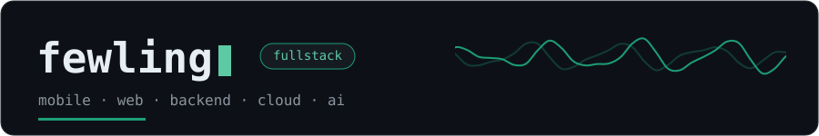
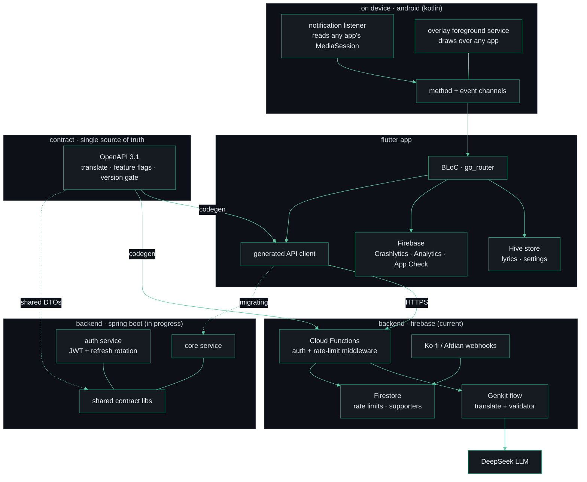

Floating Lyric reads whatever's playing through Android's notification stream and
paints time-synced lyrics in a system overlay over any app. Behind it I own the
whole stack — a contract-first API (OpenAPI → generated clients), a rate-limited
Genkit/DeepSeek translation service with output validation, and a JWT auth backend
I'm migrating off Firebase onto a self-hosted Spring Boot microservices monorepo.
I also ship fixes upstream into Flutter itself.

---

## Floating Lyric

Time-synced lyrics in a floating overlay that stays on top of any Android app.
**[On Google Play →](https://play.google.com/store/apps/details?id=com.floating.lyrics)**

**The hard parts**

- Reads the currently-playing track from any music app through a
  `NotificationListenerService` over Android MediaSessions — no per-app integration.
- Paints a system overlay over arbitrary foreground apps from a foreground service,
  bridged to Flutter across custom Method/Event platform channels.
- Time-syncs `.lrc` on device (Hive), with Storage Access Framework import and
  online lyric search as fallback.
- Translation runs server-side through a Genkit flow on DeepSeek — with an output
  validator, App Check, and per-user rate limiting.

**System design**

One contract, three languages. An OpenAPI 3.1 spec is the single source of truth:
the Dart client and the TypeScript functions are both generated from it, and the
Kotlin services share the same DTOs — so a polyglot system can't drift. The backend
is mid-migration from Firebase Cloud Functions to a self-owned **Spring Boot
microservices monorepo** (Kotlin, Java 25) — its own JWT + refresh-rotation auth
service, shared contract libraries, and custom Gradle convention plugins — for cost,
control, and owning the runtime end to end.

| Repo                                                                                                                    | Role                                       |
| ----------------------------------------------------------------------------------------------------------------------- | ------------------------------------------ |
| [flutter-floating-lyric-openapi](https://github.com/fewling/flutter-floating-lyric-openapi)                             | OpenAPI contract — single source of truth  |
| [flutter-floating-lyric-pkg-generated-openapi](https://github.com/fewling/flutter-floating-lyric-pkg-generated-openapi) | Generated Dart client package              |
| [floating-lyric-spring-boot](https://github.com/fewling/floating-lyric-spring-boot)                                     | Spring Boot (Kotlin) microservices backend |
| [floating-lyric-web](https://github.com/fewling/floating-lyric-web)                                                     | Next.js marketing site                     |

---

## How I work

- **Spec-driven** — every project starts as a written spec + plan in the repo, before any code.
- **Contract-first** — one schema generates the clients and types, so a polyglot system can't drift.
- **Tested & observable** — unit/integration tests across backends and web; crash reporting and analytics from day one.
- **I build my own tooling** — custom Gradle convention plugins, Mason bricks, and agent skills.

The stack, by layer:

<table>
  <tr>
    <td align="right"><b>languages</b></td>
    <td></td>
  </tr>
  <tr>
    <td align="right"><b>frontend</b></td>
    <td></td>
  </tr>
  <tr>
    <td align="right"><b>backend</b></td>
    <td> </td>
  </tr>
  <tr>
    <td align="right"><b>cloud</b></td>
    <td> </td>
  </tr>
  <tr>
    <td align="right"><b>devops</b></td>
    <td> </td>
  </tr>
  <tr>
    <td align="right"><b>ai</b></td>
    <td>    </td>
  </tr>
</table>

---

## Open source

**[flutter/flutter #168005](https://github.com/flutter/flutter/pull/168005)** —
added header & footer slots to the Material `NavigationDrawer` widget. Merged into
the framework, May 2025.

---

**[felixwong875@gmail.com](mailto:felixwong875@gmail.com)** ·
**[Floating Lyric on Google Play](https://play.google.com/store/apps/details?id=com.floating.lyrics)**
