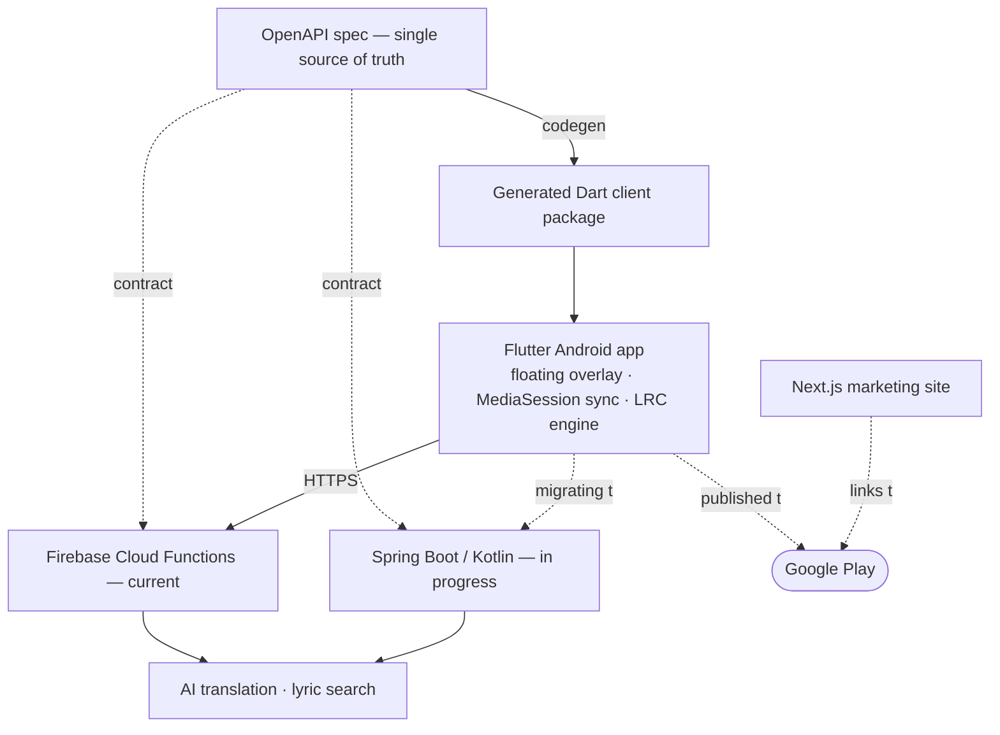

# fewling

Full-stack engineer. I build Android apps end to end — Flutter on the front, the
API contract and backend behind it. Shipped **Floating Lyric** to the Play Store
and a feature into the Flutter framework.

---

## Floating Lyric

Time-synced lyrics in a floating overlay that stays on top of any Android app.
**[On Google Play →](https://play.google.com/store/apps/details?id=com.floating.lyrics)**

**The hard parts**

- Renders a system overlay *over arbitrary foreground apps* — overlay permission
  plus a foreground service that survives backgrounding.
- Detects the currently-playing track by listening to Android's MediaSession /
  notifications — no per-app integration, works with any music app.
- Parses and time-syncs `.lrc` lyrics on device; online lyric search as fallback.
- AI translation handled server-side so the app stays thin.

**System design**

The whole product is built around an **OpenAPI spec as the single source of
truth**. The Dart client is generated from that spec, so the app and the backend
physically can't drift out of sync. The backend is mid-migration from **Firebase
Cloud Functions → a self-managed Spring Boot (Kotlin) service** — for cost
predictability, to escape vendor lock-in, to own the infrastructure and runtime,
and to take backend ownership end to end.

| Repo | Role |
| --- | --- |
| [flutter-floating-lyric-openapi](https://github.com/fewling/flutter-floating-lyric-openapi) | OpenAPI contract — single source of truth |
| [flutter-floating-lyric-pkg-generated-openapi](https://github.com/fewling/flutter-floating-lyric-pkg-generated-openapi) | Generated Dart client package |
| [floating-lyric-spring-boot](https://github.com/fewling/floating-lyric-spring-boot) | Spring Boot (Kotlin) backend — replacing Firebase |
| [floating-lyric-web](https://github.com/fewling/floating-lyric-web) | Next.js marketing site |

---

## Open source

**[flutter/flutter #168005](https://github.com/flutter/flutter/pull/168005)** —
added header & footer slots to the Material `NavigationDrawer` widget. Merged into
the framework, May 2025.

---

**[felixwong875@gmail.com](mailto:felixwong875@gmail.com)** ·
**[Floating Lyric on Google Play](https://play.google.com/store/apps/details?id=com.floating.lyrics)**
